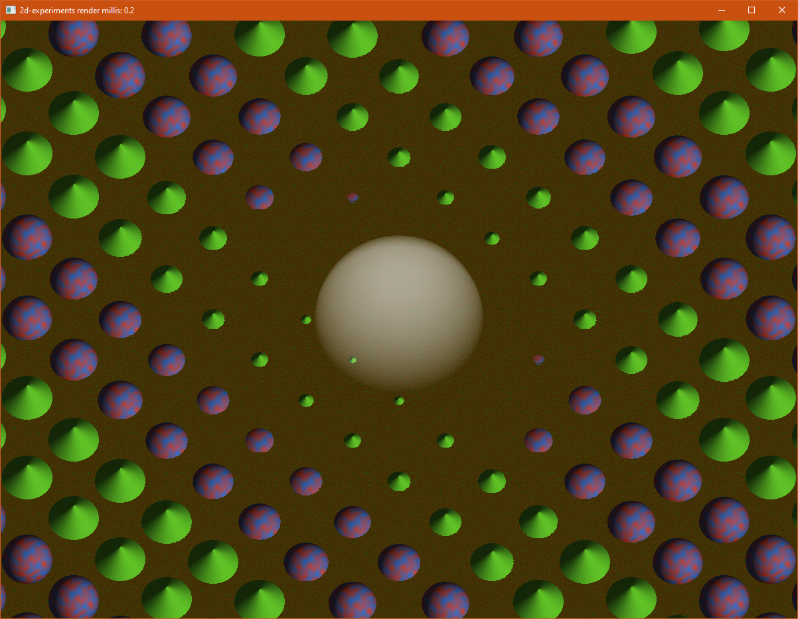

# 2d-experiments

Experiments with software rendering of 2D images with a depth and a depth buffer.
While I was able to get a lot of performance out of custom SIMD rendering code, ultimately this sort of software rendering is held back by RAM bandwidth.
With a busy, fully animated test scene, I was able to get just barely 60 FPS at 4k screen resolution when using one CPU core of an i7-9700k CPU.

